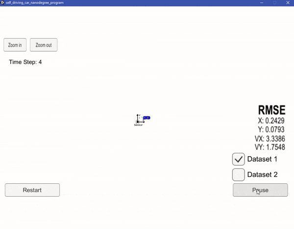
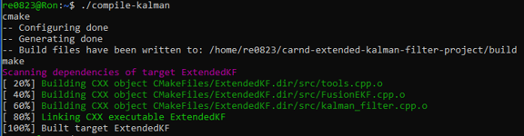
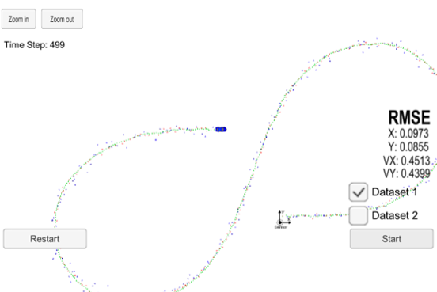
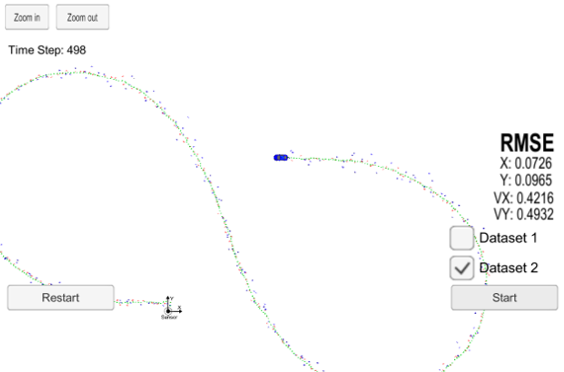
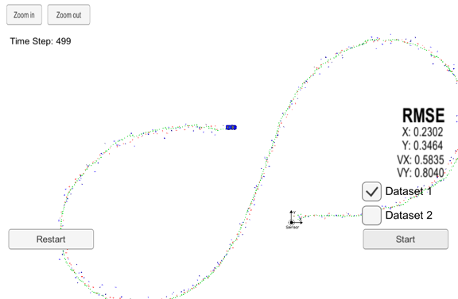
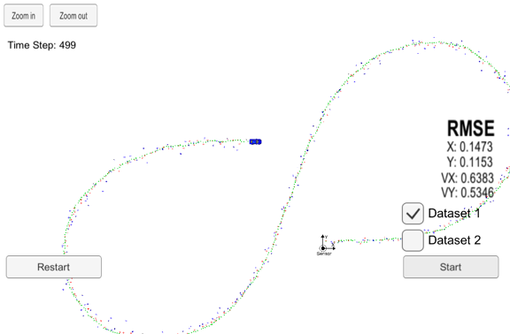
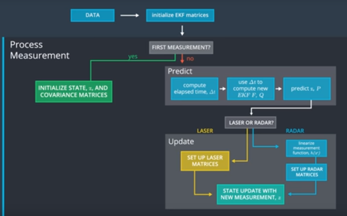

Project 1, Term 2: Extended Kalman Filters
=================================================

Final Result
--------------

Compiling
--------------

#### Code must compile without errors using cmake and make.

The code compiles without errors:

Accuracy
--------------

**px, py, vx, vy output coordinates must have an RMSE \<= [.11, .11, 0.52, 0.52]
when using the file: "obj_pose-laser-radar-synthetic-input.txt" which is the
same data file the simulator uses for Dataset 1.**

-------
##### Dataset 1 (Radar and Lidar)
RMSE is well under the target values for X, Y, VX and VY:

-------
##### Dataset 2 (Radar and Lidar)
RMSE is also below target for X, Y, VX and VY:

-------
##### Dataset 1 (Radar only)
RMSE is above target values for X, Y, VX and VY:

-------
##### Dataset 1 (Lidar only)
RMSE is also above target values for X, Y, VX and VY:

-----
Follows the Correct Algorithm
----------

**Your Sensor Fusion algorithm follows the general processing flow as taught in
the preceding lessons.**

The Sensor Fusion algorithm follows the Kalman Filter Algorithm Map as described in the Lidar and Radar Fusion with Kalman Filters in C++ lesson of Udacity's Self-Driving Car Engineer Nanodegree Program, Part 2 - Sensor Fusion, Localization and Control:

**Your Kalman Filter algorithm handles the first measurements appropriately.**

The algorithm uses the first measurements to initialize the state vector. Since
the covariance matrix does not require a first measurement for initialization, I
initialized this matrix in the Constructor.

**Your Kalman Filter algorithm first predicts then updates.**

Upon receiving a measurement after the first, the algorithm predicts object position to the current timestamp and then updates the prediction using the new measurement.

**Your Kalman Filter can handle radar and lidar measurements.**

The algorithm sets up the appropriate matrices given the type of measurement and
calls the correct measurement function for a given sensor type.

Code Efficiency
----------

**Your algorithm should avoid unnecessary calculations.**

I avoided the following:

-   Running the exact same calculation repeatedly when I could run it once,
    store the value and then reuse the value later,

-   Loops that run too many times,

-   Creating unnecessarily complex data structures when simpler structures work
    equivalently,

-   Unnecessary control flow checks.
